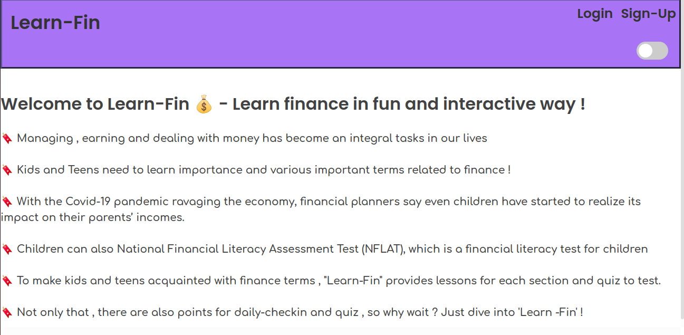
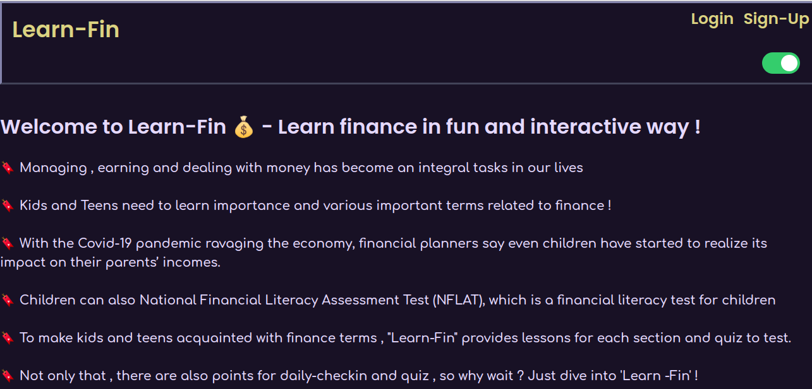
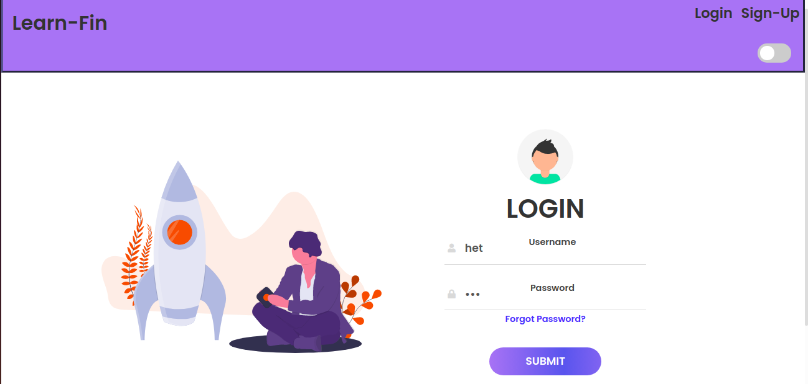
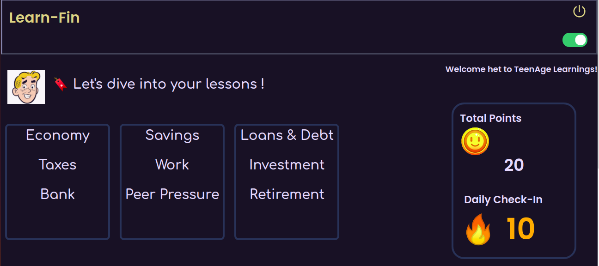
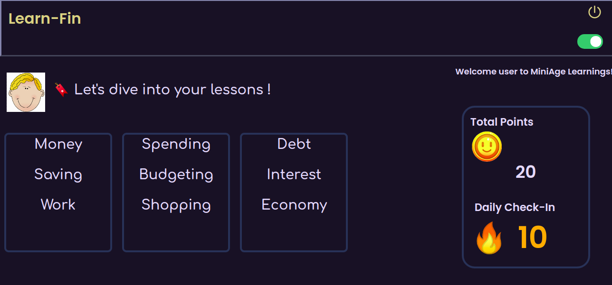
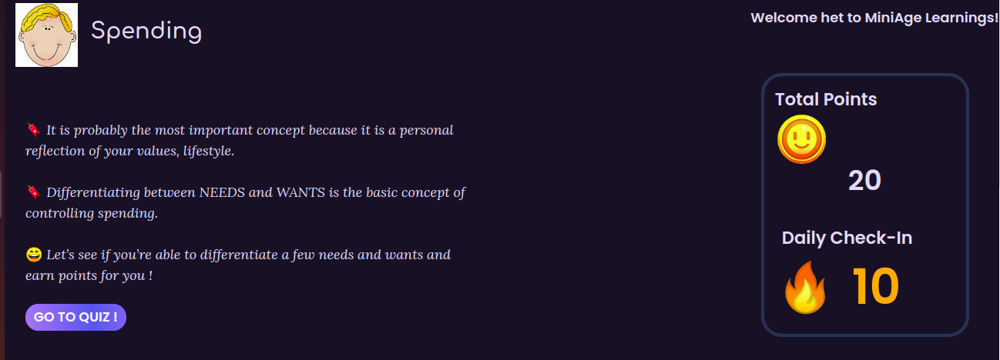
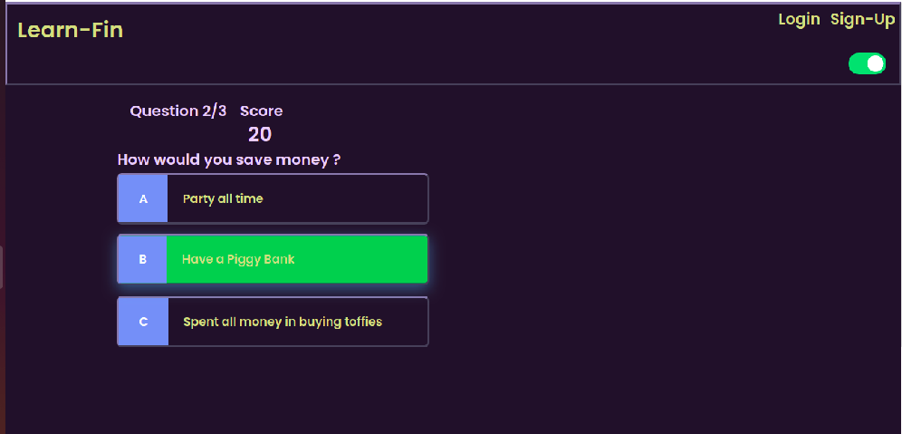
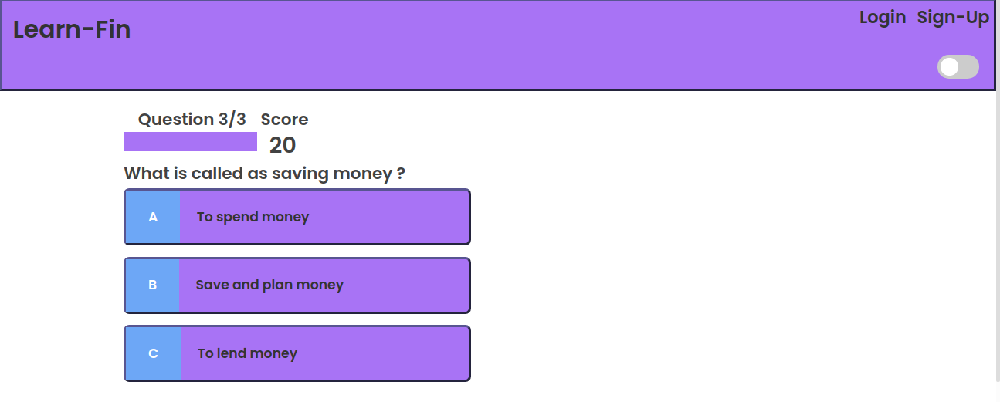

<h1 align="center">💻  Learn-Fin 💰 </h1>

🌟 Hola , Kids and Teens out there ! Learn finance and money related terms in a fun and interactive way !  🤩

## * Need and Motivation:

🔖 Managing , earning and dealing with money has become an integral tasks in our lives

🔖 Kids and Teens need to learn importance and various important terms related to finance !

🔖 With the Covid-19 pandemic ravaging the economy, financial planners say even children have started to realize its impact on their parents’ incomes.

🔖 Children can also give National Financial Literacy Assessment Test (NFLAT), which is a financial literacy test for children

🔖 To make kids and teens acquainted with finance terms , "Learn-Fin" provides lessons for each section and quiz to test.

## * Features:

* [x] Simple ,free  and easy to learn lessons under various finance sections 📝

* [x] Sections divided into MiniAge - (6-12 years) 👦👧  and TeenAge - (13-18 years) 👨👩 age groups.

* [x] Attempt fun quizzes at end of each lesson and earn coins 🔥 

* [x] Daily check-in points reward 🔥 

* [x] Dark mode enabled 🌚

## * Tech Stack:

* HTML , CSS , JavaScript.

* Node.JS

* EJS

* MongoDB

## Install the packages with :

      npm install
      
- Run on localhost with  :

      node index.js
      

## Future Scope

* [ ] Get quiz questions from websites providing finance quizzes and present it to user.

* [ ] Implement a 'Fuzzy Logic' learning model which will throw simple questions at first and then will predict user expertise and  go on increasing or decreasing level of questions according to the performance as they are attempting the quiz.

## * PPT : <a href="https://drive.google.com/file/d/1hB4PYbe_7FF9X3e0wVO1m-t1IHE_WHO3/view?usp=sharing"> Here </a>

## * Video : <a href="https://youtu.be/TgQ_-NvNEjg"> Here </a>

## Demo :

